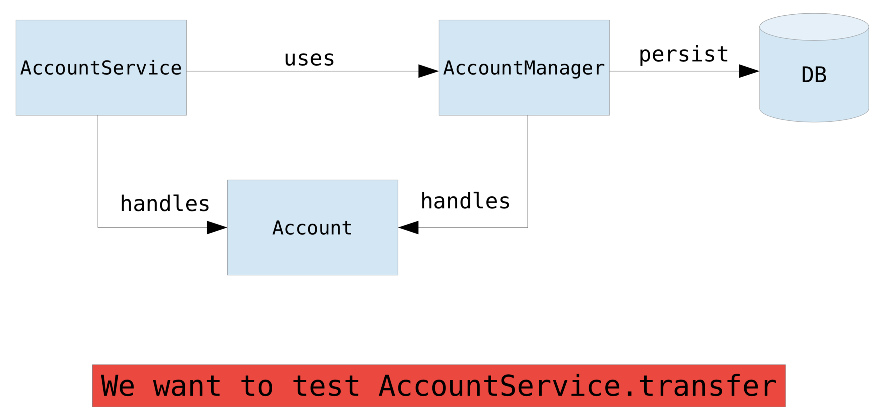

# Lab exercise 2

## Introducció al framework JMockit

*Tasques:*

* Crear un fork del repositori al vostre github, i descarregar-lo (fer un clone)
* Obrir el directori arrel del repositori al IntelliJ. Ha de detectar que és un projecte Maven
* Escriure el test unitari testTransfer per testejar el mètode AccountService.transfer, utilitzant JMockit
* Enviar un pull request al repositori original amb la vostra sol.lució . Recordeu posar el vostre nom als comentaris.

Exercici al Moodle: https://moodle2.udg.edu/mod/url/view.php?id=685412
